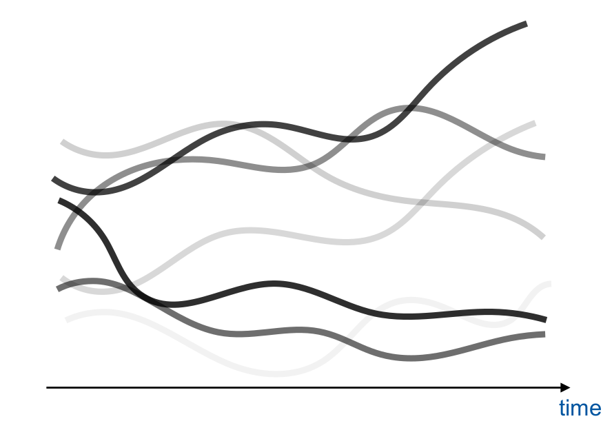
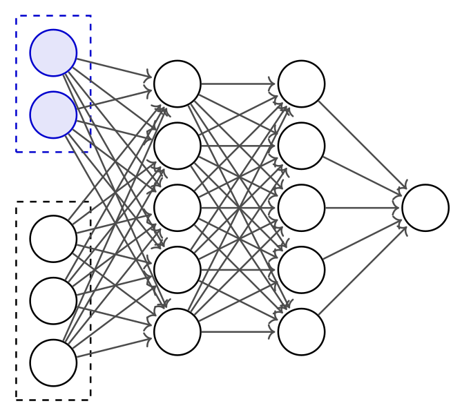

class: middle, center, title-slide
count: false

# Scaling AI for Probabilistic Programming in Scientific Simulators

EuroHPC's LUMI kick-off, Belgium 
January 14, 2021

  

Gilles Louppe 
[g.louppe@uliege.be](mailto:g.louppe@uliege.be)

---

class: middle

.center.width-100[]

.footnote[Credits: Johann Brehmer.]

---

# Simulation-based inference

 
.center.width-100[]

.footnote[Credits: Johann Brehmer.]

---

# Bayesian inference

.center.width-70[]

.center[Unconditioned probabilistic program.

$$\theta, z, x \sim p(\theta, z, x)$$]

---

class: middle
count: false

.center.width-70[]

.center[Conditioned probabilistic program.

$$\theta, z \sim p(\theta, z | x)$$]

---

class: middle

.center.width-100[]

.footnote[Credits: Johann Brehmer.]

---

# Probabilistic programming

Probabilistic programming  is a **machine learning** framework allowing us to 
- write programs that define probabilistic models;
- run automated Bayesian inference of parameters conditioned on observed outputs (data).

.center.width-90[]

.alert[Probabilistic programming normally requires one to implement a probabilistic model from scratch, in the chosen language/system.]

---

class: middle, red-slide

## Key idea

Many HPC simulators are stochastic and they define probabilistic models by sampling random numbers.
.bold[Scientific simulators are probabilistic programs!]

We "just" need an infrastructure to execute them as such.

---

class: middle

.center.width-60[]

.center[
A new probabilistic programming system  for simulators and HPC, based on PyTorch.
]

---

class: middle

.grid[
.kol-3-4[.width-100[]]
.kol-1-4[.width-100[]]
]

## Forward execution

- Run forward and catch all random choices ("hijack" all calls to RNGs).
- Record an **execution trace**: a record of all parameters, random choices, outputs
.center.width-100[]

---

class: middle

.grid[
.kol-3-4[.width-100[]]
.kol-1-4[.width-100[]]
]

## Inference

- Approximate the distribution of parameters that can produce (explain) observed data, using inference engines like MCMC.
- This is hard and computationally costly.
  - Need to run simulator up to millions of times
  - Simulator execution and MCMC inference are sequential
  - MCMC has "burn-in" and autocorrelation.

---

class: middle, center

.center.width-60[]

Good news: We can amortize the cost of inference using **deep learning**.

---

class: middle

.center.width-100[]

## Training (recording simulator behavior)

- Deep recurrent neural network learns all random choices in simulator.
- Dynamic NN: grows with simulator complexity
  - Layers get created as we learn more of the simulator.
  - 100s of millions of parameters
- Costly, but amortized: we need to train only once per given model

---

class: middle

## Inference (controlling simulator behavior)
- Trained deep NN makes intelligent choices given data observation
- Embarassingly parallel distributed inference
- No "burn-in period". No autocorrelation.

.center.width-100[]

---

class: middle
count: false

## Inference (controlling simulator behavior)
- Trained deep NN makes intelligent choices given data observation
- Embarassingly parallel distributed inference
- No "burn-in period". No autocorrelation.

.center.width-100[]

---

class: middle, center

.width-80[]

---

class: middle

# Use case: LHC 

Inverting the Large Hadron Collider

---

class: middle, black-slide

.center.width-75[]

## Large Hadron Collider

- Seek to uncover secrets of the universe (new particles).
- Today, physicists compare observed data to detailed simulations, using billions of CPU hours for scans of simulation parameters (inefficient, labor-intensive, sometimes ad-hoc).
- PyProb replaces this with automated, efficient inference; grounded in a statistical framework.

---

class: middle

## Physics expressed in simulator code

- We base on our proof-of-principle on **existing** Sherpa simulation (1M lines of C++ code).
- Execution traces represent particle physics collisions and decays.
- PyProb will enable interpretability by relating a detector observation to possible traces that can be related back to the physics.

.center.width-100[]

---

class: middle, center

.width-100[]

---

class: middle, center
count: false

.width-100[]

---

class: middle, center
count: false

.width-100[]

---

class: middle, center

.width-100[]

PyProb gives access to all latent variables:  allows answering .italic[any] model-based question.

---

class: middle

# Reaching supercomputing scale

---

class: middle

.width-100[]

.center[
Need for HPC resources and considerable optimization,  for both simulation and NN training.
]

---

class: middle

.grid[
.kol-1-2[
## Platforms and experimental setup

- NERSC Cori Cray XC40
- NERSC Edison Cray XC30
- Intel Diamond Cluster
]
.kol-1-2[.center.width-95[]]
]

---

class: middle

## Scaling

.width-100[]

---

class: middle

.grid[
.kol-1-2[
## Large-scale training

- Dataset of 15M Sherpa execution traces (1.7 TB)
- Fully synchronous data parallel training on 1024 nodes (32768 cores) using PyTorch-MPI
- Global mini-batch size of 128000
- Overall 14000x speedup
  - Months of training in minutes
  - Ability to retrain model quickly is transformative for research
]
.kol-1-2[.center.width-95[]]

]

---

class: middle

.center[

Reminder: We are doing all this to performance inference.

.width-100[]

]

---

class: middle 

## Science results

.center.width-65[]

.center[First tractable Bayesian inference for LHC physics (Full posterior and interpretability)]

---

# Summary

- PyProb is a probabilistic software framework to execute and control exisiting HPC simulator code bases.
- Synchronous data parallel training of a NN is made possible thanks to HPC.
- AI-powered probabilistic programming is for the first time practical for large-scale, real-word science models.

This is just the beginning...

.center.width-70[]

---

# A team effort

 

.center.width-100[]

---

count: false

# References

.small-font[
- Baydin, A. G., Shao, L., Bhimji, W., Heinrich, L., Meadows, L., Liu, J., ... & Ma, M. (2019). Etalumis: Bringing Probabilistic Programming to Scientific Simulators at Scale. arXiv preprint arXiv:1907.03382.
- Baydin, A. G., Heinrich, L., Bhimji, W., Gram-Hansen, B., Louppe, G., Shao, L., ... & Wood, F. (2018). Efficient Probabilistic Inference in the Quest for Physics Beyond the Standard Model. arXiv preprint arXiv:1807.07706.
- Casado, M. L., Baydin, A. G., Rubio, D. M., Le, T. A., Wood, F., Heinrich, L., ... & Bhimji, W. (2017). Improvements to Inference Compilation for Probabilistic Programming in Large-Scale Scientific Simulators. arXiv preprint arXiv:1712.07901.
]
